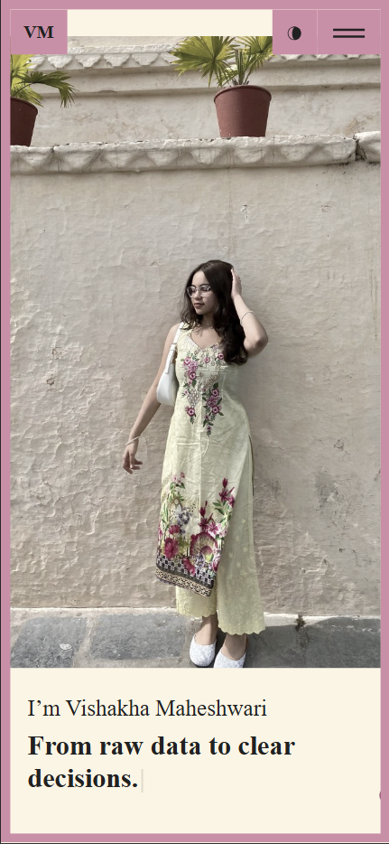

# 💼 React Portfolio — Ready To Use Template

**Live demo:** [https://svish-portfolio.netlify.app](https://svish-portfolio.netlify.app)

**Author:** [Vishakha Maheshwari](https://github.com/CodeByVish)

A modern, responsive React portfolio with light/dark mode and a one-file content model.
Update text, skills, and projects right on GitHub—no terminal required.
Deploy instantly on **Netlify** .


---

## 👀 Preview

**Desktop**


**Mobile**


> See “Add screenshots to this README” below if these don’t show yet.

---

## ✨ Why this template

* **Single content file.** Edit headline, About Me, timeline, skills, projects & socials in `src/content_option.js`.
* **Light/Dark mode.** Built-in theme toggle (top-right).
* **Social rail.** GitHub + LinkedIn on the left.
* **Download CV.** Button links to a PDF in `/public` for a frictionless download.
* **SPA-proof.** Works on Netlify (hash routing + refresh fix).
* **Responsive.** Looks great on phones, tablets, and desktops.

---

## 🚀 Get started (no terminal)

1. **Use this repo**

   * If it’s a template → **Use this template** → create your repo
   * Or **Fork** it into your GitHub

2. **Edit your content**
   Open `src/content_option.js` on GitHub (✏️) and update:

   * `logotext`, `meta.title`, `meta.description`
   * `introdata` (title, 3 `animated` lines, description, `your_img_url`)
   * `dataabout` (About Me), `worktimeline` (roles), `skills` (0–100), `services`
   * `dataportfolio` (cards)
     ⚠️ Keep the key name **`desctiption`** (expected by the component)
   * `contactConfig`
   * `socialprofils` (GitHub + LinkedIn links)

3. **Add your photo**
   Upload to `src/asset1/` (e.g., `me.jpg`) and set:

   ```js
   import me from "./asset1/me.jpg";
   // ...
   your_img_url: me
   ```

4. **Add your CV**
   Upload `Your_Name_CV.pdf` to `public/` and ensure the button uses:

   ```jsx
   <a href="/Your_Name_CV.pdf" target="_blank" rel="noopener noreferrer">
     Download CV
   </a>
   ```

---

## 🌐 Deploy to Netlify (recommended)

1. Go to [https://app.netlify.com/start](https://app.netlify.com/start) → pick **GitHub** → choose your repo
2. **Build command:** `npm run build`  **Publish directory:** `build`
3. **Environment variables:**

   * `NODE_VERSION = 18`
   * *(Optional)* `CI = false` (if ESLint warnings block builds)
4. Ensure these files exist in your repo:

   * `package.json` contains `"homepage": "."`
   * `public/_redirects` contains:

     ```
     /* /index.html 200
     ```
5. Deploy → set a clean site name under **Domain management**.

---

## 🧩 What to edit where

* **All text & data** → `src/content_option.js`

  * `introdata.animated` → your 3 short typewriter lines
  * `dataportfolio` → cards (`img`, `desctiption`, optional `link`)
* **Hero & buttons** → `src/pages/home/index.js`
* **Social rail** → `src/components/socialicons/` (reads `socialprofils`)
* **Header / nav** → `src/header/`
* **Styles** → `src/index.css`, `src/app/App.css` + per-section CSS

---

## 🌗 Light / Dark mode

Toggle lives in the header. Colors use CSS variables — tweak in `src/index.css` & `src/app/App.css`.

---

## 🖼️ Add screenshots to this README

1. Create folders in your repo: `docs/screenshots/`

   * On GitHub → **Add file → Create new file** → type `docs/screenshots/.gitkeep` → **Commit**.
2. Upload your images into that folder:

   * **hero-desktop.png** — desktop hero screenshot
   * **hero-mobile.png** — mobile hero screenshot
3. Commit. The image paths above already point to:
   `./docs/screenshots/hero-desktop.png` and `./docs/screenshots/hero-mobile.png`
4. If they still don’t show, hard-refresh the GitHub page (Ctrl + F5) and verify the filenames match exactly (including case).

---

## 🔁 Updating later

* Edit on GitHub → **Commit** → Netlify redeploys automatically
* Hard refresh once (Ctrl + F5)

---

## 🧪 Troubleshooting

**Blank page on Netlify**

* `package.json` has `"homepage": "."`
* `public/_redirects` contains `/* /index.html 200`
* `src/app/App.js` uses **HashRouter** (or BrowserRouter with `basename="/"`)

**Social icons not clickable**

* Links come from `socialprofils` in `content_option.js`
* Don’t pass empty props to `<Socialicons />`
* CSS safety:

  ```css
  .stick_follow_icon { z-index: 1000; }
  .cursor__dot { pointer-events: none !important; }
  ```

---

## 📜 License

See `LICENSE`. Attribution appreciated if you use this as a starting point.

---


