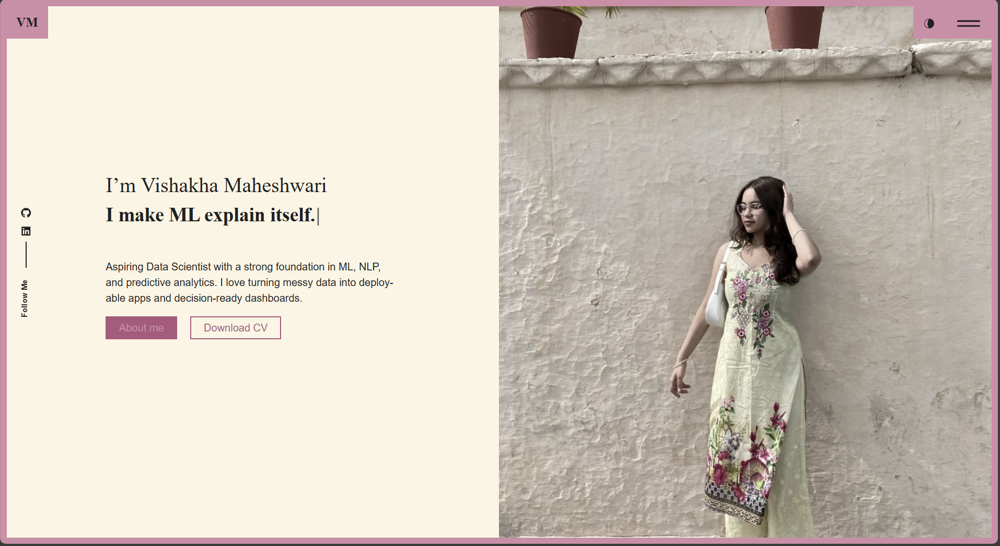

# 💼 React Portfolio — Ready To Use Template

**Live demo:** https://vishakha-maheshwari-portfolio.vercel.app/

**Author:** [Vishakha Maheshwari](https://github.com/CodeByVish)

A modern, responsive React portfolio with light/dark mode and a one-file content model.
Update text, skills, and projects right on GitHub.
Deploy instantly on **Vercel** .


---

## 👀 Preview

**Desktop**



---

## ✨ Why this template

* **Single content file.** Edit headline, About Me, timeline, skills, projects & socials in `src/content_option.js`.
* **Light/Dark mode.** Built-in theme toggle (top-right).
* **Social rail.** GitHub + LinkedIn on the left.
* **Download CV.** Button links to a PDF in `/public` for a frictionless download.
* **Responsive.** Looks great on phones, tablets, and desktops.

---

## 🚀 Get started (no terminal)

1. **Use this repo**

   * If it’s a template → **Use this template** → create your repo
   * Or **Fork** it into your GitHub

2. **Edit your content**
   Open `src/content_option.js` on GitHub (✏️) and update:

   * `logotext`, `meta.title`, `meta.description`
   * `introdata` (title, 3 `animated` lines, description, `your_img_url`)
   * `dataabout` (About Me), `worktimeline` (roles), `skills` (0–100), `services`
   * `dataportfolio` (cards)
     ⚠️ Keep the key name **`desctiption`** (expected by the component)
   * `contactConfig`
   * `socialprofils` (GitHub + LinkedIn links)

3. **Add your photo**
   Upload to `src/asset1/` (e.g., `me.jpg`) and set:

   ```js
   import me from "./asset1/me.jpg";
   // ...
   your_img_url: me
   ```

4. **Add your CV**
   Upload `Your_Name_CV.pdf` to `public/` and ensure the button uses:

   ```jsx
   <a href="/Your_Name_CV.pdf" target="_blank" rel="noopener noreferrer">
     Download CV
   </a>
   ```

---

## 🌐 Deploy to Vercel

1. Go to **[https://vercel.com](https://vercel.com)** → **Continue with GitHub** → authorize.
2. Click **Add New → Project** → select **your repo**.
3. **Framework Preset:** *Create React App*
4. **Build command:**

   ```bash
   npm run build
   ```
5. **Output directory:**

   ```text
   build
   ```
6. Click **Deploy** → your site goes live at `*.vercel.app`.
7. *(Optional)* **Settings → Domains** → add a clean subdomain and **Set as Primary**.

> This template uses **HashRouter**, so routes like `/#/about` work out of the box on Vercel.


---

## 🧩 What to edit where

* **All text & data** → `src/content_option.js`

  * `introdata.animated` → your 3 short typewriter lines
  * `dataportfolio` → cards (`img`, `desctiption`, optional `link`)
* **Hero & buttons** → `src/pages/home/index.js`
* **Social rail** → `src/components/socialicons/` (reads `socialprofils`)
* **Header / nav** → `src/header/`
* **Styles** → `src/index.css`, `src/app/App.css` + per-section CSS

---

## 🌗 Light / Dark mode

Toggle lives in the header. Colors use CSS variables — tweak in `src/index.css` & `src/app/App.css`.


---

## 🔁 Updating later

* Edit on GitHub → **Commit** → Vercel redeploys automatically
* Hard refresh once (Ctrl + F5)

---

## 🧪 Troubleshooting


**Social icons not clickable**

* Links come from `socialprofils` in `content_option.js`
* Don’t pass empty props to `<Socialicons />`
* CSS safety:

  ```css
  .stick_follow_icon { z-index: 1000; }
  .cursor__dot { pointer-events: none !important; }
  ```

---

## 📜 License

See `LICENSE`. Attribution appreciated if you use this as a starting point.

---


